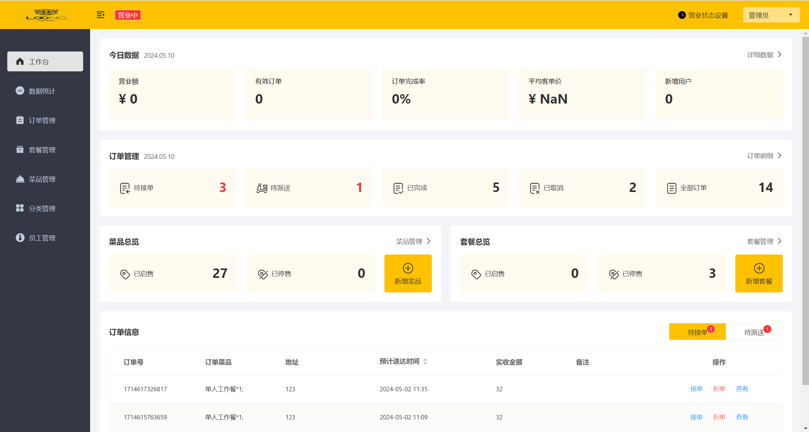
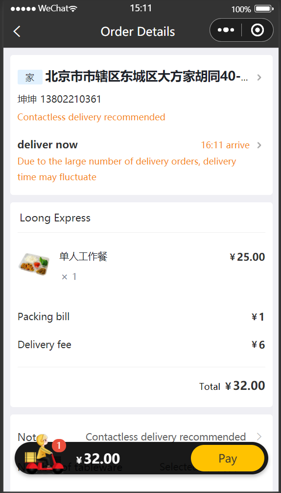

# LoongExpress

    

            

* en [English](README.md)(README.md)
* zh_CN [简体中文](README.zh-CN.md)(README.zh-CN.md)

## Introduction

[Websitesite](www.loongexpress.xyz)

Loong-express is a restaurant management system that provides order tracking, menue editing and staff management for managers and food ordering for customers.

### Project preview

#### Admin Dashboard

#### Statistics Page

#### User Ordering Page

#### Payment

### Modules Introduction

#### Admin Management

| Module              | Description                                                                                                                                                    |
| ------------------- | -------------------------------------------------------------------------------------------------------------------------------------------------------------- |
| Login/Logout        | Internal staff must log in before accessing the system management backend.                                                                                     |
| Employee Management | Administrators can manage employee information in the system backend, including searching, adding, editing, and disabling.                                     |
| Category Management | Mainly manages and maintains the categories of dishes or set meals currently operated by the restaurant, including searching, adding, modifying, and deleting. |
| Dish Management     | Mainly maintains information of dishes under various categories, including searching, adding, modifying, deleting, enabling, and disabling.                    |
| Set Meal Management | Mainly maintains information of set meals in the current restaurant, including searching, adding, modifying, deleting, enabling, and disabling.                |
| Order Management    | Mainly manages user orders placed on the mobile end, including searching, canceling, dispatching, completing, as well as downloading order reports.            |
| Data Statistics     | Mainly performs various data statistics for the restaurant, such as turnover, user count, and orders.                                                          |

#### User

| Module                   | Description                                                                                                                                                                                                                                                                                  |
| ------------------------ | -------------------------------------------------------------------------------------------------------------------------------------------------------------------------------------------------------------------------------------------------------------------------------------------- |
| Login/Logout             | Implement WeChat authorization login by integrating with WeChat Mini Program open API interfaces.                                                                                                                                                                                            |
| Ordering - Menu          | Users can select dish categories or set meal categories in the ordering interface, and load the corresponding dish information based on the current selection for users to query and select.                                                                                                 |
| Ordering - Shopping Cart | Selected dishes will be added to the user's shopping cart, mainly including functions such as querying the shopping cart, adding items to the shopping cart, deleting items from the shopping cart, and clearing the shopping cart.                                                          |
| Order Payment            | After users have selected dishes/set meals, they can proceed to checkout and payment for the items in their shopping cart, requiring order payment at this point.                                                                                                                            |
| Personal Information     | The user's personal information interface provides access to historical orders and address management. Users can view historical order information, use the reorder function, and manage delivery addresses, including setting default addresses, adding, modifying, and deleting addresses. |
