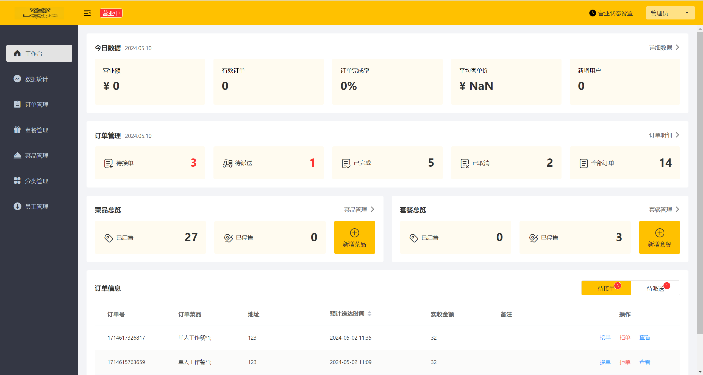
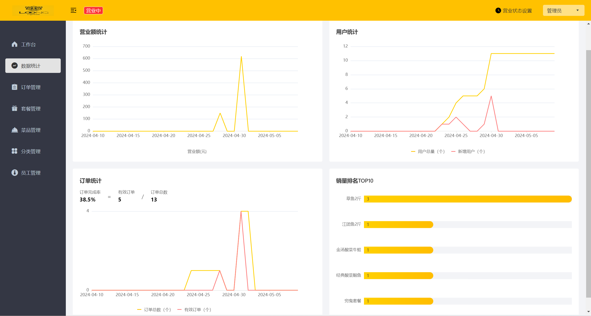
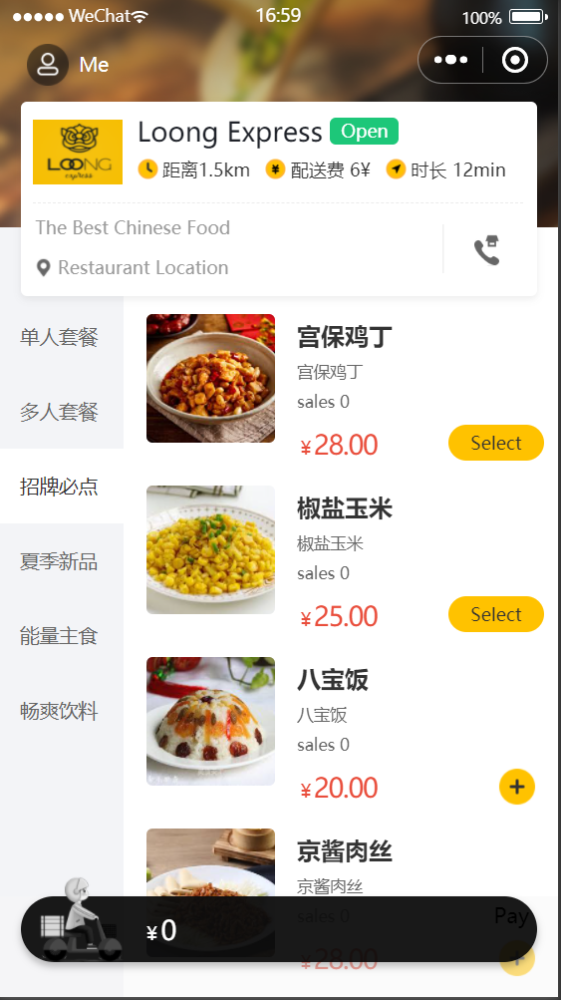
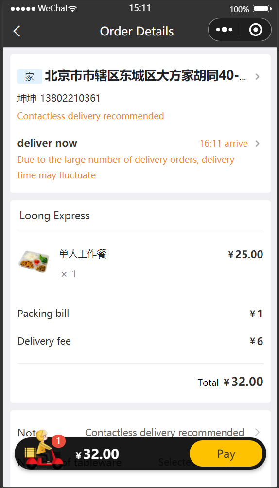

# 神龙中餐

    

            

* en [English](README.md)(README.md)
* zh_CN [简体中文](README.zh-CN.md)(README.zh-CN.md)

## 简介

[预览网址](http://www.loongexpress.xyz)

基于黑马程序员苍穹外卖，本项目是专门为餐饮企业（餐厅、饭店）定制的一款软件产品，包括 系统管理后台 和 小程序端应用 两部分。项目涉及少量的Spring定时任务，缓存和Redis的使用，适合学习完Java Web的小白学习。

### 项目预览

后台管理端:

小程序端:

### 模块介绍

#### **管理端**

餐饮企业内部员工使用。 主要功能有:

| 模块      | 描述                                                                                      |
| --------- | ----------------------------------------------------------------------------------------- |
| 登录/退出 | 内部员工必须登录后,才可以访问系统管理后台                                                 |
| 员工管理  | 管理员可以在系统后台对员工信息进行管理，包含查询、新增、编辑、禁用等功能                  |
| 分类管理  | 主要对当前餐厅经营的 菜品分类 或 套餐分类 进行管理维护， 包含查询、新增、修改、删除等功能 |
| 菜品管理  | 主要维护各个分类下的菜品信息，包含查询、新增、修改、删除、启售、停售等功能                |
| 套餐管理  | 主要维护当前餐厅中的套餐信息，包含查询、新增、修改、删除、启售、停售等功能                |
| 订单管理  | 主要维护用户在移动端下的订单信息，包含查询、取消、派送、完成，以及订单报表下载等功能      |
| 数据统计  | 主要完成对餐厅的各类数据统计，如营业额、用户数量、订单等                                  |

#### **用户端**

移动端应用主要提供给消费者使用。主要功能有:

| 模块        | 描述                                                                                              |
| ----------- | ------------------------------------------------------------------------------------------------- |
| 登录/退出   | 用户需要通过微信授权后登录使用小程序进行点餐                                                      |
| 点餐-菜单   | 在点餐界面需要展示出菜品分类/套餐分类, 并根据当前选择的分类加载其中的菜品信息, 供用户查询选择     |
| 点餐-购物车 | 用户选中的菜品就会加入用户的购物车, 主要包含 查询购物车、加入购物车、删除购物车、清空购物车等功能 |
| 订单支付    | 用户选完菜品/套餐后, 可以对购物车菜品进行结算支付, 这时就需要进行订单的支付                       |
| 个人信息    | 在个人中心页面中会展示当前用户的基本信息, 用户可以管理收货地址, 也可以查询历史订单数据            |
